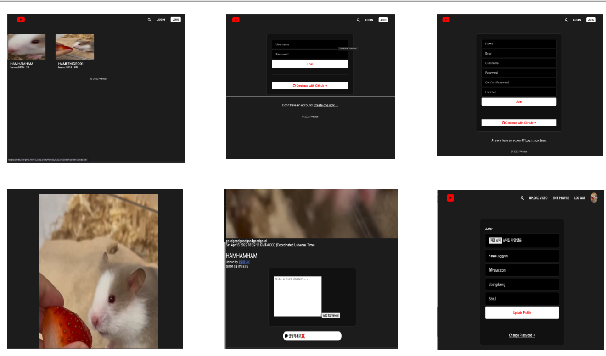
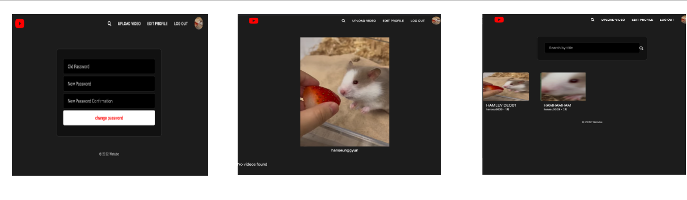
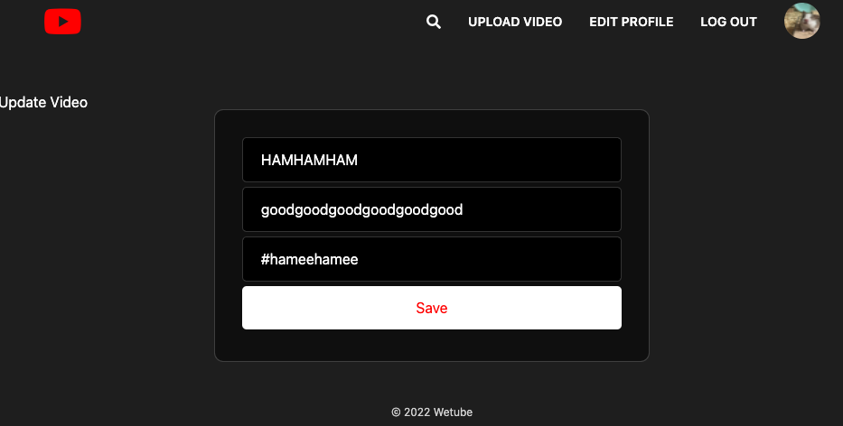

# DoongTube 
### 진행 기간 
2022/01/20 -> 2022/03/26

### 프로젝트 설명 
- 많은 사람들이 사용하는 유튜브를 나만의 웹페이지로 만들어 나의 영상을 올리고 싶어 클론 코딩을 하게 되었습니다.
- nomadCoders 를 보고 MongoDB,Express, JS(ES6)등을 강의를 보고 공부하며 만든 클론 프로젝트 입니다.
- 도중에 생긴 오류, 환경 설정등은 웹 서칭을 통해서 해결하였습니다. 
- Webpack, babel등을 Package.json 을 통해서 직접 적용해주었다.

### 🔨 사용한 스택 
Front-End : PUG, SCSS 
Back-End : Node.js, express  
DevOps : AWS- S3, MongoDB, herokuApp  
Tools : VS Code

# 자세한 프로젝트 설명  
## 각각의 라우터 URL구성 
### URL이란?  
내가 페이지에 접속하여 웹 브라우저에게 얻어오거나 보내줄 때 이러한 정보 자원들이 있는 곳을 나타내는 일련의 규칙이다.
### 라우터란? 
라우터는 내가 작업중인 주제를 기반으로 URL을 그룹화 해준다. 각각의 라우터를 Controller와 이를 연결해주는 역할을 수행해준다. 
### routeRouter
/ -> 홈 
/join -> 회원가입  
/login -> 로그인  
/search -> 비디오 찾기  

### userRouter (유저관련)
/users/logout -> 유저 로그아웃 
/users/edit -> 유저 정보 변경 
/users/github/start -> 깃허브  
/users/github/finish -> 깃허브  
/users/change-password -> 유저 비밀번호 변경  

### VideoRouter (비디오관련)
/videos/:id -> 비디오 보기 
/videos/upload -> 비디오 업로드  
/videos/:id/edit -> 비디오 정보 변경  
/videos/:id/delete -> 비디오 삭제  

#### apiRouter (Api라우터관련)
/api/videos/:id/view -> 동영상 본 횟수  
/api/videos/:id/comment -> 댓글 생성  
/api/videos/comment/:id/delete -> 댓글 삭제 

# UI구성 

